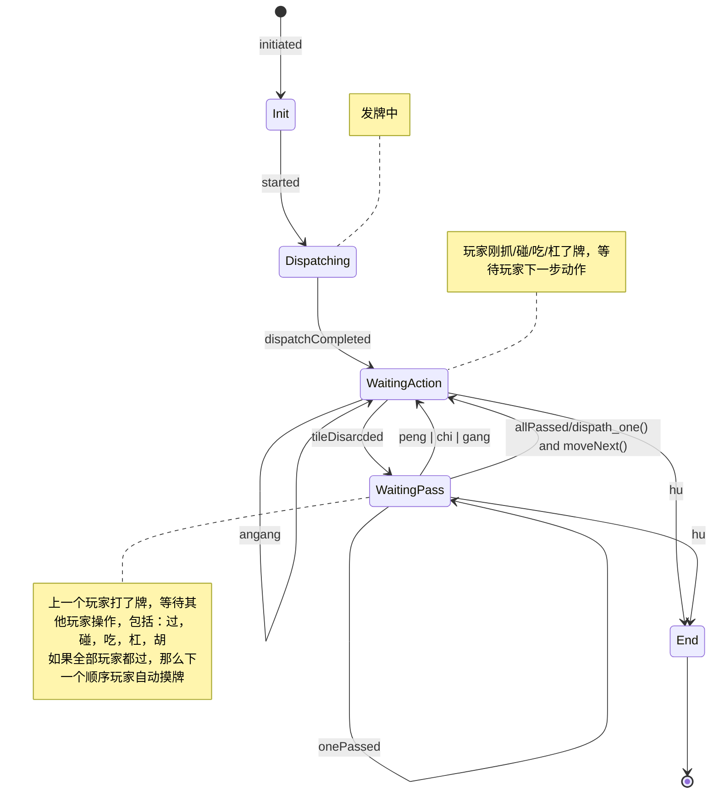

```mermaid
stateDiagram-v2
    [*] --> Init: initiated

    Init
    Init --> Dispatching: started


    Dispatching
    note left of Dispatching
        发牌中
    end note
    Dispatching --> WaitingAction: dispatchCompleted

    WaitingAction
    note left of WaitingAction
        玩家刚抓/碰/吃/杠了牌，等待玩家下一步动作
    end note
    WaitingAction --> WaitingPass: tileDisarcded
    WaitingAction --> WaitingAction: angang
    WaitingAction --> End: hu

    WaitingPass
    note right of WaitingPass
        上一个玩家打了牌，等待其他玩家操作，包括：过，碰，吃，杠，胡
        如果全部玩家都过，那么下一个顺序玩家自动摸牌
    end note
    WaitingPass --> WaitingPass: onePassed
    WaitingPass --> WaitingAction: peng | chi | gang
    WaitingPass --> WaitingAction: allPassed/dispath_one() and moveNext()
    WaitingPass --> End: hu

    End --> [*]
```
